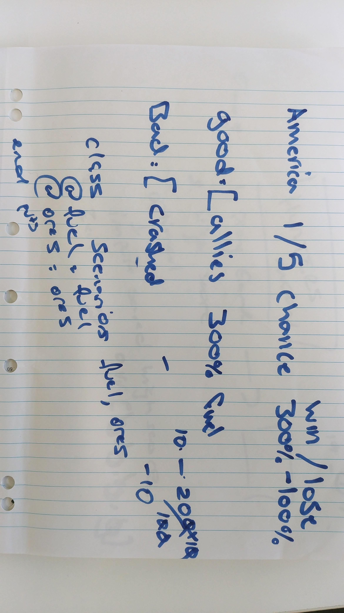

# Hunter's Moon
Hunter's Moon is an entertainment terminal application that revolves around the gambling model. You take part as the captain of a highly advanced spaceship from an interstellar civilization. Your aim is to travel between galactic bodies to harvest **ores** as your civilization is threatened from diminishing supplies. Earth is suggested to have ample supplies of **ore** and you go to investigate. You begin the invasion but quickly realize that your **fuel** supply is limited. 

## Purpose
The aim of the game is to score as many points as possible in the form of **ores** before your **fuel** supply is exhausted. The model of the game is as follows:

1. List of Continents to invade is displayed with their risk, rewards and odds of success
2. Player chooses a number and the invasion begins
3. If successful, player scores **fuel** and/or **ores** depending on the Continent. If unsuccessful, player's **fuel** spply is penalized
4. If player has remaining fuel, they are prompted to further invade other Continents (or the same)
5. Game ends when player's **fuel** supply is exhausted

## Functionality
* **colorize** and **terminal-table** gems are utilized to improve the game interface
* ASCII art is implemented to present a retro experience
* Incorporated classes and modules to avoid code repitition and clutter

## Getting Started
### Prerequisites
The following gems are required:
    
    colorize
    terminal-table

### Installing
```bash
$ gem install colorize
$ gem install terminal-table
```

## Instructions
1. Run script to start the application
```bash
    $ ruby main.rb
```
2.  Press "1" to Play Game


1. Select a Continent to invade by pressing "1" - "7". If successful, **fuel** and/or **ore** is rewarded


3. If unsuccessful, **fuel** will be penalized by a magnitude associated with the Continent chosen


4. Player will be prompted again to invade another Continent until **fuel** drops to zero
5. When **fuel** reaches zero, game over!


6. Press "2" for high score


7. Press "x" to exit


## Planning
### Suggested timeline


### Work-Flow Diagram


### Trello Board


### Early desings of the game


<!--  -->

<!--  -->



<!--  -->

<!--  -->

## Further Improvements
* Incorporate **Hard Mode**
* Link a CSV so history of high scores can be maintained
* Further refactoring

## Authors
* Simon Truong
* Sherin Samuel
* Bashir Towdiee

## Links
[My GitHub](https://github.com/Simon-Truong/huntersmoon)